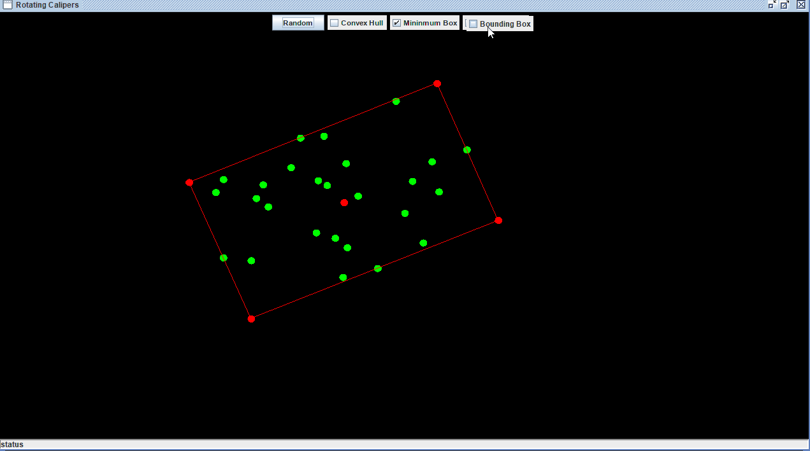
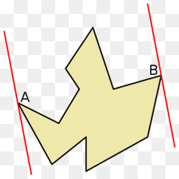
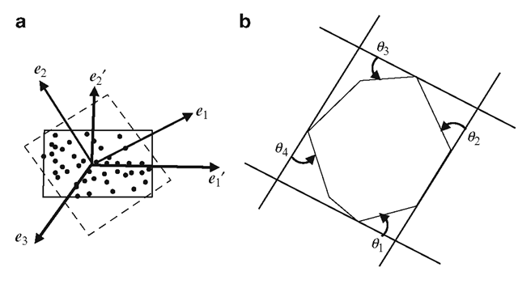

# Rotating Calipers

Final Project for Data Structure & Algorithms Summer 2019.



## Table of Contents

> References to explanations of the sourcecode

- [Rotating Calipers](#rotating-calipers)
  - [Table of Contents](#table-of-contents)
  - [Introduction](#introduction)
  - [Definitions](#definitions)
  - [Description](#description)
  - [Performance](#performance)
  - [Code snippet](#code-snippet)
  - [Proof](#proof)
  - [Applications](#applications)
  - [References](#references)


## Introduction

The Rotating Calipers algorithm was initially made by Michael Shamos. Shamos used this algorithm to generate all antipodal pairs of points on a convex polygon and to compute the diameter of a convex polygon. This algorithm is based on a proof by Freeman and Shapira and was later generalized by George Toussaint to work in many more use cases such as on the surface of a cone. Godfriend Toussaint gave this algorithm it's name, Rotating Calipers referencing a pair of calipers going across the polygon. My motivations for choosing this algorithm was so I could learn more about the field of Computational Geometry.

The theorem by Shapira states 

```
"The smallest-area enclosing rectangle of a polygon has a side collinear with one of the edges of its convex hull"
```
This theorem reduces the number of candidate rectangles down to ones which share an edge with the convex hull.

<a href=""></a>


For my implementation I used the algorithm to generate a minimum bounding box, the easiest way to find a minimum bounding box is to find the mininimum and maximum (x,y) coordinates for that set of points and to construct a rectangle from it. The primary reason for using this algorithm is that it is the only method for solving problems such as the minimum bounding box in 2D not counting approximation methods. Rotating Calipers has been generalized to 3D by O'Rourke which operates in cubic time, although for the 3D case approximation algorithms are generally used due to this performance issue. One huge motivation for wanting to find the OMBB of a polygon is that it gives a better average approximation for the area of a set of points than other simple shapes such as bounding circles.

## Definitions
Starting off this paper with a quick rundown with the definition of the more obscure terms that will be used in it.

**Convex Hull** - The smallest convex set that contains a set of points S. A convex hull is unique and is the smallest possible volume containing an object or set of points.

**Bounding Volume** - In computational geometry a bounding volume for a set of arbitrary objects is a volume that completly encompasses all the objects inside. A variety of structures can act as bounding volumes such as convex polygons, rectangles, triangles or spheres.

**Supporting Lines** - A line that goes through the polygon such that the whole polygon lies on one side of the line.

**Antipodal Points** - A pair of vertices such that one can draw two parallel supporting lines through them.

**Diameter of a polygon** - The largest distance between a pair of vertices in the set of points S.

**AABB(Axis Aligned Bounding Box)** - The smallest rectangle containing the point such at each side is parallel to the x or y axis.

**OMBB(Oriented Minimum Bounding Box)** - The smallest rectangle where the orientation does not matter.

## Description

Rotating Calipers is a general use case algorithm in computational geometry that can be used to solve a wide variety
of problems ranging from finding the diameter of a convex polygon, finding the distance between two convex polygons, etc. The term Calipers is used as a visual metaphor for the "parallel supporting lines" that sweet across the polygon.
The Rotating Calipers algorithm generates the OMBB or the Optimal minimum bounding box of a set of points.
This algorithm is possible due to a theorem by Shapira which states that the mininmum bounding box of a convex polygon lies on one of
that polygon's edges. This makes it possible to iterate over the polygon's edges to find the OMBB. Godfried described this algorithm in his paper as a general method for solving a variety of problems in computational similar to convex hull generation or delaunay triangulation. 



The algorithm operates in seven steps
1. Generate a convex hull from a set of points
2. Find the minimum or extreme points of the convex hull
3. Construct two vertical supporting lines at the minimum and maximum (x, y) coordinates
4. Set the current Rectangle area A_min = Infinity
5. Rotate the supporting lines until one coincides with an edge of the convex hull. After doing so compute the area of the current rectangle and update the min area stored.
6. Repeat step 5 for all edges of the convex hull.
7. Return the rectangle with the minimum area.


The criteria of the fourth and fifth step can be changed so that instead of checking and updating the rectangles area you can choose to check the perimeter and minimize for that. This will give you rectangle of smallest perimeter rather than area.

## Performance

The Rotating Calipers algorithm operates in Linear Time but requires a convex hull, so it is typically bounded by the convex hull generation which in my case is n log n. It makes more sense to use multiple variables when analyzing the performance of the Rotating Calipers algorithm due to it taking it requiring a convex polygon to operate on but many applications that require bounding boxes or distances across a set of points such as in networking will typically not already have a convex hull generated. This leads to Rotating Calipers being bound by the generation of this convex hull since rotating calipers operates in linear time on the edges of the polygon passed to it. Since the Rotating Calipers algorithm itself is only O(m) or linear time, the n refers to the number of points used in the calculation and m is referring to the number of verticies in the convex hull. So the Rotating Calipers algorithm will perform worse in situations where all or most points in the set are located on the convex hull, such as in the situation where the points lie on a circle. This algorithm is able to achieve linear time because while iterating over the convex hull there will typically only be four points of the convex hull touching the rectangle at any given time. Unless two points are collinear such as in the image below.



However it doesn't matter if two points are collinear, one can be picked arbitrarily and it will not effect the resulting bounding box. Taking this into account when calculating the bounding boxes you will only need to update on point for the calculation of each one. This means you can calculate a bounding box in constant time for each edge. Giving you linear running time. Taking all this together you can simplify the running time for Rotating Calipers down to the time it takes to calculate the convex hull, O(n log n).

## Code snippet

```java
//Iterate over the edges of the convex hull
for(int i=0;i<polygon.edgeCount();i++)
{
    Point edge = polygon.getEdge(i);
    //Rotate the polygon so that the current edge is
    //parallel to a major axis
    //The y-Axis in this use case
    double theta = Math.acos(edge.normalize().y);
    polygon.rotate(theta);
    //Calculate a bounding box
    rects[i] = boundingBox(polygon);
    polygon.rotate(-theta);
    rects[i].rotate(-theta, polygon.getCenter());
}
```

## Proof

The theorem that this algorithm was built upon was proved by first breaking it apart into two theorems whose results would lead to the final theorem.


## Applications

The Rotating calipers algorithm and computational geometry as a whole has a variety of applications in many fields ranging from computer graphics to computer networking primarily for visible testing and collision detection. Rotating Calipers is used to generate simple bounding polygons that can be used in physics simulations, this is useful because in the field of computer graphics many operations such as ray tracing are expensive, by checking if a ray intersects its an objects bonding box before doing the ray intersections this can avoid unnecssary expensive operations. This type of testing is known as visibility testing in computer graphics. An example of this can be seen in the action of calculating a bounding box for a car. A physics simulations would need to check if the car is intersecting the ground and perform the operations neccessary to seperate them, if one used a sphere or ellipsoid as a bounding volume then these would intersect the ground and force the physics calculations to go through, but a bounding box would not intersect and act as an accurate approximation of the cars area.

## References

https://www.iis.sinica.edu.tw/papers/liu/21474-F.pdf

http://citeseerx.ist.psu.edu/viewdoc/download?doi=10.1.1.155.5671&rep=rep1&type=pdf